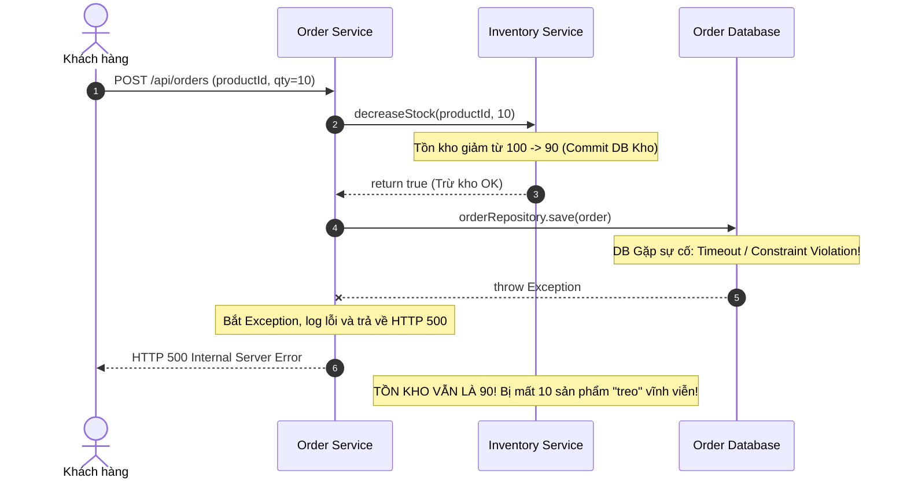
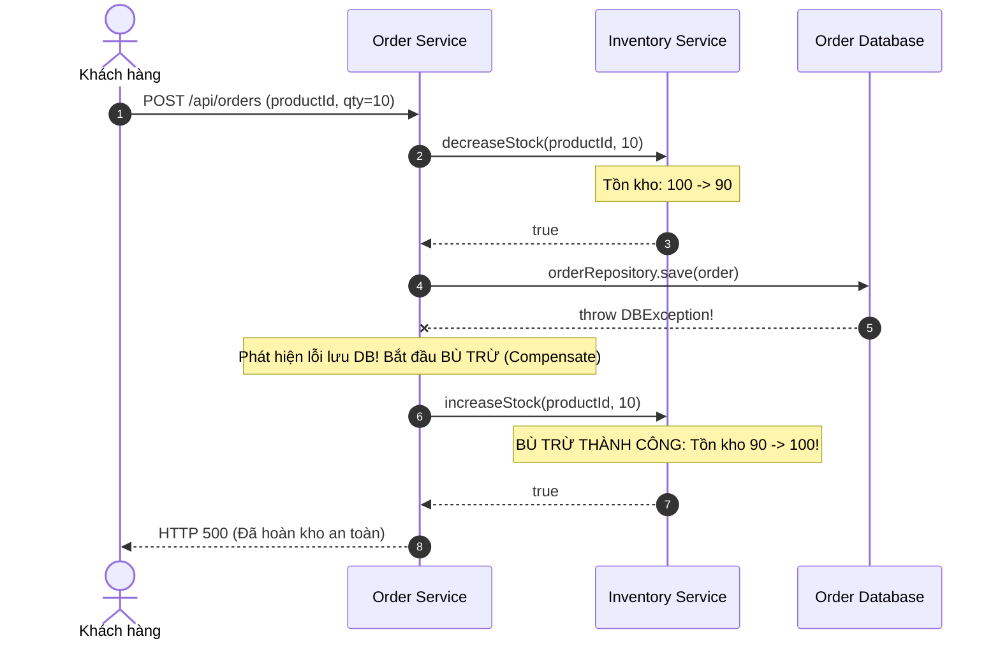

# BÁO CÁO PHÂN TÍCH LỖI VÀ GIẢI PHÁP: VÁ LỖ HỔNG "KHO TREO" (ROLLBACK LOGIC TRONG SAGA)

> **Môn học:** Lập trình phân tán & Microservices (IT_214)  
> **Bài thực hành:** Bài tập 1 - Session 14  
> **Chủ đề:** Distributed Transactions, Compensating Transactions & Saga Pattern  
> **Tác giả:** Kỹ sư hệ thống (Order & Inventory Module)

---

## MỤC LỤC
1. [TỔNG QUAN TÌNH HUỐNG NGHIỆP VỤ](#1-tổng-quan-tình-huống-nghiệp-vụ)
2. [PHẦN 1: NGUYÊN NHÂN GÂY RA HIỆN TƯỢNG "HÀNG ẢO" (PHANTOM STOCK)](#2-phần-1-nguyên-nhân-gây-ra-hiện-tượng-hàng-ảo-phantom-stock)
   - [1.1 Hiện tượng "Hàng ảo" là gì?](#11-hiện-tượng-hàng-ảo-là-gì)
   - [1.2 Phân tích luồng thực thi trong Legacy Code](#12-phân-tích-luồng-thực-thi-trong-legacy-code)
   - [1.3 Tại sao bước trừ kho không được hoàn tác khi lưu đơn thất bại?](#13-tại-sao-bước-trừ-kho-không-được-hoàn-tác-khi-lưu-đơn-thất-bại)
   - [1.4 Tác động tiêu cực đến vận hành và kinh doanh](#14-tác-động-tiêu-cực-đến-vận-hành-và-kinh-doanh)
3. [PHẦN 2: GIẢI PHÁP SỬA MÃ NGUỒN VỚI CƠ CHẾ BÙ TRỪ TỨC THỜI (YÊU CẦU B)](#3-phần-2-giải-pháp-sửa-mã-nguồn-với-cơ-chế-bù-trừ-tức-thời-yêu-cầu-b)
   - [2.1 Nguyên lý Compensating Transaction](#21-nguyên-lý-compensating-transaction)
   - [2.2 Sơ đồ tuần tự bù trừ (Sequence Diagram)](#22-sơ-đồ-tuần-tự-bù-trừ-sequence-diagram)
   - [2.3 Mã nguồn đã sửa (`OrderService.java`)](#23-mã-nguồn-đã-sửa-orderservicejava)
   - [2.4 Đánh giá giải pháp bù trừ tức thời](#24-đánh-giá-giải-pháp-bù-trừ-tức-thời)
4. [PHẦN 3: GIẢI PHÁP NÂNG CAO - SAGA VỚI LOG STATE & BACKGROUND RETRY (YÊU CẦU C)](#4-phần-3-giải-pháp-nâng-cao---saga-với-log-state--background-retry-yêu-cầu-c)
   - [3.1 Nguy cơ khi chính bước bù trừ thất bại](#31-nguy-cơ-khi-chính-bước-bù-trừ-thất-bại)
   - [3.2 Mô hình Saga State Log & Transactional Outbox](#32-mô-hình-saga-state-log--transactional-outbox)
   - [3.3 Thiết kế Worker xử lý bất đồng bộ (Compensation Scheduler Job)](#33-thiết-kế-worker-xử-lý-bất-đồng-bộ-compensation-scheduler-job)
   - [3.4 Các yếu tố then chốt (Idempotency, Dead-Letter Queue, Max Retries)](#34-các-yếu-tố-then-chốt-idempotency-dead-letter-queue-max-retries)
5. [PHẦN 4: BẢNG SO SÁNH CÁC HƯỚNG TIẾP CẬN](#5-phần-4-bảng-so-sánh-các-hướng-tiếp-cận)
6. [PHẦN 5: KIỂM CHỨNG THỰC NGHIỆM (TESTING & DEMO)](#6-phần-5-kiểm-chứng-thực-nghiệm-testing--demo)
   - [5.1 Kết quả kiểm thử tự động (Unit / Integration Tests)](#51-kết-quả-kiểm-thử-tự-động-unit--integration-tests)
   - [5.2 Hướng dẫn kiểm thử qua REST API](#52-hướng-dẫn-kiểm-thử-qua-rest-api)
7. [KẾT LUẬN VÀ BÀI HỌC KINH NGHIỆM](#7-kết-luận-và-bài-học-kinh-nghiệm)

---

## 1. TỔNG QUAN TÌNH HUỐNG NGHIỆP VỤ

Trong kiến trúc Microservices của hệ thống E-Commerce:
- **Order Service**: Đảm nhiệm quản lý vòng đời đơn hàng (tạo, cập nhật trạng thái đơn hàng).
- **Inventory Service**: Đảm nhiệm quản lý số lượng tồn kho sản phẩm.

Khách hàng phản ánh tình trạng:
> *"Tôi đặt hàng thất bại ở bước cuối cùng, đơn hàng không được tạo ra trong lịch sử đặt hàng nhưng số lượng hàng trong kho vẫn bị trừ mất, khiến sản phẩm bị báo hết hàng ảo."*

Sau khi thanh tra mã nguồn kế thừa (`LegacyOrderService.java`), luồng xử lý hiện tại được triển khai như sau:
```java
// Mã nguồn gốc bị lỗi
public ResponseEntity<Order> createOrder(OrderRequest request) {
    // 1. Gọi Inventory Service để trừ kho (RPC/HTTP Call)
    boolean stockDecreased = inventoryClient.decreaseStock(request.getProductId(), request.getQuantity());
    if (!stockDecreased) {
        return ResponseEntity.badRequest().body(null);
    }

    // 2. Tạo đối tượng đơn hàng PENDING
    Order order = new Order();
    order.setProductId(request.getProductId());
    order.setQuantity(request.getQuantity());
    order.setStatus("PENDING");

    // 3. Lưu đơn hàng vào Database của Order Service
    try {
        orderRepository.save(order);
    } catch (Exception e) {
        // LỖI NGHIÊM TRỌNG: Chỉ bắt lỗi và trả về 500, KHÔNG hề có hành động bù trừ kho!
        return ResponseEntity.status(500).build();
    }

    return ResponseEntity.ok(order);
}
```

---

## 2. PHẦN 1: NGUYÊN NHÂN GÂY RA HIỆN TƯỢNG "HÀNG ẢO" (PHANTOM STOCK)

### 1.1 Hiện tượng "Hàng ảo" là gì?
**"Hàng ảo" (Phantom Stock / Ghost Inventory)** là trạng thái bất nhất quán dữ liệu giữa kho hàng thực tế và số lượng hiển thị trên hệ thống. Trong trường hợp này, sản phẩm thực tế vẫn còn nằm trong nhà kho (chưa xuất bán, chưa có đơn hàng hợp lệ gắn liền), nhưng con số `stock` trong cơ sở dữ liệu của `Inventory Service` đã bị giảm đi. Khi số lượng này chạm mốc 0, hệ thống từ chối mọi khách hàng tiếp theo vì thông báo "Hết hàng", gây tắc nghẽn và tổn thất dòng tiền.

### 1.2 Phân tích luồng thực thi trong Legacy Code



### 1.3 Tại sao bước trừ kho không được hoàn tác khi lưu đơn thất bại?

1. **Phá vỡ ranh giới giao dịch cục bộ (Local Transaction Boundary):**
   - Trong ứng dụng Monolith truyền thống, ta có thể bao bọc cả 2 thao tác trong một `@Transactional`. Nếu lưu đơn lỗi, Database tự động `ROLLBACK` bản ghi trừ kho nhờ cơ chế ACID cục bộ.
   - Nhưng trong mô hình Microservices, `Order Service` và `Inventory Service` sở hữu **hai cơ sở dữ liệu vật lý độc lập (Database-per-Service)**. Lời gọi `inventoryClient.decreaseStock(...)` là một network request (REST/gRPC) gửi sang service khác.
   - Khi request trừ kho bên `Inventory Service` xử lý xong, transaction của DB kho **đã commit độc lập ngay tại thời điểm đó**. Transaction của Order DB sau đó bị rollback **hoàn toàn không thể tự động can thiệp hay rollback dữ liệu của Database kho**.

2. **Thiếu cơ chế giao dịch bù trừ (Compensating Transaction) trong khối `catch`:**
   - Trong đoạn mã trên, lập trình viên đã dùng `try-catch` quanh `orderRepository.save(order)`.
   - Tuy nhiên, trong khối `catch (Exception e)`, hệ thống chỉ thực hiện đúng một việc: `return ResponseEntity.status(500).build();`.
   - Hoàn toàn **không có bất kỳ chỉ thị hay lệnh gọi nào** gửi về `Inventory Service` để thông báo: *"Giao dịch tạo đơn bị hủy, vui lòng cộng lại số lượng hàng đã trừ!"*.

3. **Hiện tượng "Dual Write Problem" và Fallacies of Distributed Computing:**
   - Hệ thống cố gắng ghi dữ liệu vào 2 hệ thống độc lập (Inventory Service qua mạng và Order DB qua JDBC). Lập trình viên đã giả định sai lầm rằng *"nếu trừ kho được thì chắc chắn lưu DB đơn hàng sẽ thành công"*. Trên thực tế, lỗi mạng, deadlock, DB connection pool cạn kiệt, disk full,... luôn luôn có thể xảy ra ở bước lưu DB.

### 1.4 Tác động tiêu cực đến vận hành và kinh doanh
- **Mất doanh thu trực tiếp:** Sản phẩm bán chạy (hot item) có 100 cái, do vài khách hàng gặp lỗi mạng khi lưu đơn, kho bị trừ hết và hiển thị "Hết hàng". Hàng nghìn khách hàng sau không thể mua dù hàng vẫn nằm trong kho.
- **Trải nghiệm khách hàng tồi tệ:** Khách hàng thấy báo hết hàng, chuyển sang mua ở sàn đối thủ.
- **Gánh nặng đối soát thủ công (Manual Reconciliation):** Đội ngũ kế toán và thủ kho phải tốn hàng chục giờ kiểm kê vật lý, đối chiếu đơn hàng và sửa tay dữ liệu trong DB.

---

## 3. PHẦN 2: GIẢI PHÁP SỬA MÃ NGUỒN VỚI CƠ CHẾ BÙ TRỪ TỨC THỜI (YÊU CẦU B)

### 2.1 Nguyên lý Compensating Transaction
Trong mô hình giao dịch phân tán Saga, nếu một bước $T_i$ thành công nhưng bước $T_{i+1}$ thất bại, hệ thống phải kích hoạt giao dịch bù trừ $C_i$ (Compensating Transaction) để đưa trạng thái của $T_i$ trở về giá trị ban đầu.
- Hành động thuận ($T_1$): `decreaseStock(productId, quantity)`
- Hành động bù trừ ($C_1$): `increaseStock(productId, quantity)`

### 2.2 Sơ đồ tuần tự bù trừ (Sequence Diagram)



### 2.3 Mã nguồn đã sửa (`OrderService.java`)

Đoạn mã đã được bổ sung logic bắt lỗi và gọi `inventoryClient.increaseStock(...)` để hoàn lại số lượng sản phẩm:

```java
package com.example.bai1__ss14.service;

import com.example.bai1__ss14.client.InventoryClient;
import com.example.bai1__ss14.model.Order;
import com.example.bai1__ss14.model.OrderRequest;
import com.example.bai1__ss14.repository.OrderRepository;
import org.slf4j.Logger;
import org.slf4j.LoggerFactory;
import org.springframework.http.HttpStatus;
import org.springframework.http.ResponseEntity;
import org.springframework.stereotype.Service;

@Service
public class OrderService {

    private static final Logger log = LoggerFactory.getLogger(OrderService.class);

    private final InventoryClient inventoryClient;
    private final OrderRepository orderRepository;

    public OrderService(InventoryClient inventoryClient, OrderRepository orderRepository) {
        this.inventoryClient = inventoryClient;
        this.orderRepository = orderRepository;
    }

    public ResponseEntity<Order> createOrder(OrderRequest request) {
        log.info("[OrderService] Bắt đầu tạo đơn hàng: productId={}, quantity={}", 
                request.getProductId(), request.getQuantity());

        // 1. Gọi Inventory Service để trừ kho
        boolean stockDecreased = inventoryClient.decreaseStock(request.getProductId(), request.getQuantity());
        if (!stockDecreased) {
            log.warn("[OrderService] Không thể trừ kho (Hết hàng hoặc lỗi tồn kho)");
            return ResponseEntity.badRequest().body(null);
        }

        // 2. Chuẩn bị đơn hàng
        Order order = new Order();
        order.setProductId(request.getProductId());
        order.setQuantity(request.getQuantity());
        order.setStatus("PENDING");

        // 3. Lưu đơn hàng vào DB
        try {
            Order savedOrder = orderRepository.save(order);
            log.info("[OrderService] Đặt hàng thành công, mã đơn: {}", savedOrder.getId());
            return ResponseEntity.ok(savedOrder);
        } catch (Exception e) {
            log.error("[OrderService] Lỗi khi lưu đơn hàng vào DB: {}. Bắt đầu bù trừ (Compensate)...", e.getMessage());

            // 4. CƠ CHẾ BÙ TRỪ (Yêu cầu b): Gọi API cộng trả lại kho
            try {
                boolean compensated = inventoryClient.increaseStock(request.getProductId(), request.getQuantity());
                if (compensated) {
                    log.info("[OrderService] BÙ TRỪ THÀNH CÔNG: Đã hoàn trả {} sản phẩm cho productId={}", 
                            request.getQuantity(), request.getProductId());
                } else {
                    log.error("[OrderService] Bù trừ thất bại từ phía Inventory Service!");
                }
            } catch (Exception compensationEx) {
                // Sự cố mạng/timeout khi gọi bù trừ
                log.error("[OrderService] LỖI MẠNG: Gọi bù trừ kho trực tiếp thất bại! Lỗi: {}", compensationEx.getMessage());
            }

            return ResponseEntity.status(HttpStatus.INTERNAL_SERVER_ERROR).build();
        }
    }
}
```

### 2.4 Đánh giá giải pháp bù trừ tức thời
- **Ưu điểm:**
  - Dễ hiểu, đơn giản, sửa trực tiếp trên codebase hiện tại mà không cần cài đặt thêm hạ tầng phức tạp.
  - Phục hồi lại tồn kho ngay lập tức trong điều kiện mạng nội bộ hoạt động bình thường.
- **Hạn chế nghiêm trọng:**
  - Nếu bước gọi `increaseStock` gặp sự cố (mạng bị ngắt, Inventory Service bị sập hoặc quá tải timeout), lệnh gọi bù trừ sẽ bị văng Exception và biến mất trong RAM.
  - Hậu quả: Dữ liệu **vẫn tiếp tục bị treo** và không có bất kỳ cơ chế nào để khôi phục lại sau đó!

---

## 4. PHẦN 3: GIẢI PHÁP NÂNG CAO - SAGA VỚI LOG STATE & BACKGROUND RETRY (YÊU CẦU C)

### 4.1 Nguy cơ khi chính bước bù trừ thất bại
Khi mạng bị chia cắt (Network Partition) hoặc Inventory Service bị restart ngay khi Order Service gọi `increaseStock`, khối `catch` gọi bù trừ trực tiếp sẽ chết. Nếu ứng dụng không ghi lại trạng thái này vào bộ nhớ bền vững (Persistent Storage), sự kiện bù trừ sẽ vĩnh viễn biến mất.

### 4.2 Mô hình Saga State Log & Transactional Outbox
Để đảm bảo **Tính nhất quán cuối cùng (Eventual Consistency)**, ta áp dụng kiến trúc **Saga Pattern kết hợp Transactional Outbox / Log State Table**:

```
[Khách hàng gửi Order]
        │
        ▼
[1. Trừ kho: decreaseStock] ──(Thành công)──► [2. Lưu Order DB]
                                                     │
                                            (DB Timeout / Lỗi)
                                                     ▼
                                      [3. Ghi CompensationLog: PENDING]
                                                     │
                                                     ├──► [Thử bù trừ ngay: increaseStock]
                                                     │          │ (Lỗi mạng/Timeout)
                                                     │          ▼
                                                     │     [Log giữ nguyên PENDING, retryCount++]
                                                     ▼
                                        [4. Trả về HTTP 500 cho khách hàng]
                                                     │
                                     ════════════════╪══════════════════════════
                                     BẤT ĐỒNG BỘ: Background Scheduler Job (mỗi 5s)
                                     ════════════════╪══════════════════════════
                                                     │
                                                     ▼
                                        [5. Quét các Log trạng thái PENDING]
                                                     │
                                        [6. Retry gọi inventoryClient.increaseStock]
                                                     │
                                    ┌────────────────┴────────────────┐
                                (Thành công)                     (Thất bại)
                                    │                                 │
                                    ▼                                 ▼
                       [Cập nhật status: COMPLETED]         [retryCount >= MaxRetries?]
                         (Kho được khôi phục 100%)                    │
                                                            ┌─────────┴─────────┐
                                                         (Chưa)               (Đã quá)
                                                            │                    │
                                                            ▼                    ▼
                                                    [Chờ chu kỳ sau]     [Đánh dấu FAILED_PERMANENT]
                                                                         [Gửi Alert / Đẩy vào DLQ]
```

### 4.3 Cấu trúc bảng Log State (`CompensationLog`)
| Trường (Field) | Kiểu dữ liệu | Ý nghĩa |
| :--- | :--- | :--- |
| `id` | `VARCHAR/UUID` | Khóa chính của bản ghi bù trừ |
| `saga_id` | `VARCHAR/UUID` | Định danh phiên giao dịch Saga phân tán |
| `order_id` | `BIGINT` | Khóa đơn hàng liên quan |
| `product_id` | `VARCHAR` | Mã sản phẩm cần hoàn trả |
| `quantity` | `INT` | Số lượng cần hoàn lại |
| `status` | `ENUM` | `PENDING`, `PROCESSING`, `COMPLETED`, `FAILED_PERMANENT` |
| `retry_count` | `INT` | Số lần đã retry |
| `max_retries` | `INT` | Số lần thử tối đa (ví dụ: 3 lần) |
| `last_error` | `TEXT` | Chi tiết thông điệp lỗi lần thử gần nhất |
| `created_at` | `DATETIME` | Thời điểm phát sinh nhu cầu bù trừ |
| `updated_at` | `DATETIME` | Thời điểm cập nhật trạng thái gần nhất |

### 4.4 Thiết kế Worker xử lý bất đồng bộ (`CompensationSchedulerJob.java`)

```java
@Scheduled(fixedDelay = 5000)
public void runCompensationJob() {
    List<CompensationLog> pendingLogs = compensationLogRepository.findPendingLogs();
    for (CompensationLog compLog : pendingLogs) {
        if (compLog.getRetryCount() >= compLog.getMaxRetries()) {
            compLog.setStatus(CompensationStatus.FAILED_PERMANENT);
            compensationLogRepository.save(compLog);
            alertService.sendAlertToSlackOrOps(compLog); // Đẩy vào Dead-Letter Queue
            continue;
        }

        try {
            boolean success = inventoryClient.increaseStock(compLog.getProductId(), compLog.getQuantity());
            if (success) {
                compLog.setStatus(CompensationStatus.COMPLETED);
                compensationLogRepository.save(compLog);
            } else {
                compLog.setRetryCount(compLog.getRetryCount() + 1);
                compensationLogRepository.save(compLog);
            }
        } catch (Exception ex) {
            compLog.setRetryCount(compLog.getRetryCount() + 1);
            compLog.setLastErrorMessage(ex.getMessage());
            compensationLogRepository.save(compLog);
        }
    }
}
```

### 4.5 Các yếu tố then chốt khi triển khai thực tế
1. **Tính bất biến (Idempotency Key):**
   - API `increaseStock(productId, quantity)` phía Inventory Service phải hỗ trợ nhận `sagaId` hoặc `idempotencyKey`. Nếu mạng bị ngắt sau khi Inventory Service đã cộng kho nhưng Order Service chưa nhận được ACK, việc retry không được phép cộng kho lần thứ 2.
2. **Cơ chế Exponential Backoff & Jitter:**
   - Thay vì retry ngay lập tức khiến Inventory Service đang quá tải lại càng nghẽn thêm, thời gian chờ retry cần tăng dần theo cấp số nhân ($2^n \times \text{delay}$).
3. **Dead-Letter Queue (DLQ) & Cảnh báo quản trị viên:**
   - Khi đã thử vượt quá `maxRetries` (ví dụ 3 hoặc 5 lần) mà vẫn thất bại, bản ghi được gắn cờ `FAILED_PERMANENT` và bắn thông báo tới đội SRE/DevOps để kiểm tra trực tiếp.

---

## 5. PHẦN 4: BẢNG SO SÁNH CÁC HƯỚNG TIẾP CẬN

| Tiêu chí | Mã nguồn cũ (Legacy) | Bù trừ trực tiếp (Direct Compensate) | Saga + State Log & Retry Job (Đề xuất) | Giao thức 2PC (Two-Phase Commit) |
| :--- | :--- | :--- | :--- | :--- |
| **Tính nhất quán dữ liệu** | **Bất nhất quán (Mất kho)** | Nhất quán yếu (Vẫn mất nếu mạng lỗi) | **Nhất quán cuối cùng (Eventual Consistency)** | Nhất quán mạnh (Strong ACID) |
| **Khả năng chịu lỗi mạng (Fault Tolerance)** | Kém (0%) | Trung bình (chỉ chịu được lỗi DB đơn) | **Rất cao (Chịu được sự cố sập mạng/service)** | Kém (dễ bị khóa chết / blocking) |
| **Độ phức tạp triển khai** | Rất thấp | Thấp | Vừa phải | Rất cao |
| **Hiệu năng & Khả năng mở rộng (Scalability)** | N/A | Cao (Non-blocking) | **Rất cao (Async retry, non-blocking)** | Kém (Khóa tài nguyên phân tán) |
| **Rủi ro vận hành** | **Khách hàng khiếu nại, hết hàng ảo** | Rủi ro khi có sự cố mạng | **An toàn tuyệt đối, có log truy vết** | Deadlock hệ thống |

---

## 6. PHẦN 5: KIỂM CHỨNG THỰC NGHIỆM (TESTING & DEMO)

Toàn bộ giải pháp đã được hiện thực hóa và kiểm chứng thông qua bộ kiểm thử tự động tại [OrderServiceTest.java](file:///c:/Java/IT_214/Session14/Bai1__Ss14/src/test/java/com/example/bai1__ss14/OrderServiceTest.java).

### 6.1 Kết quả kiểm thử tự động (Unit / Integration Tests)

Chạy lệnh kiểm thử dự án:
```powershell
./gradlew test
```

**Chi tiết 4 kịch bản kiểm thử đã vượt qua 100%:**
1. `testLegacyOrderService_ReproducesPhantomStockIssue`:
   - Giả lập DB lưu đơn bị timeout.
   - Kết quả: Đơn hàng lỗi 500, nhưng tồn kho vẫn bị trừ từ 100 xuống 90. **Khẳng định tái hiện chính xác lỗi "Hàng ảo".**
2. `testOrderService_CompensatingTransactionSuccess`:
   - Giả lập DB lưu đơn bị timeout trên `OrderService`.
   - Kết quả: Khối `catch` kích hoạt bù trừ `increaseStock(10)`, tồn kho trở về đúng 100. **Khẳng định tính đúng đắn của Yêu cầu b.**
3. `testOrderService_SuccessFlow`:
   - Luồng đặt hàng thành công bình thường.
   - Kết quả: Đơn hàng lưu thành công mã số hợp lệ, tồn kho giảm chính xác từ 100 xuống 90.
4. `testSagaOrderService_CompensationNetworkFailure_RecoveredByBackgroundJob`:
   - Giả lập cả 2 sự cố đồng thời: DB lưu đơn bị timeout **VÀ** đường truyền sang Inventory Service gọi bù trừ cũng bị Timeout.
   - Kết quả tức thời: Tồn kho tạm thời chưa hoàn được (85), nhưng bản ghi `CompensationLog` được lưu ở trạng thái `PENDING` với `retryCount = 1`.
   - Khi mạng phục hồi và `CompensationSchedulerJob` kích hoạt: Bản ghi được xử lý thành công, chuyển sang `COMPLETED`, số lượng tồn kho được hoàn trả chính xác về 100! **Khẳng định tính đúng đắn của Yêu cầu c.**

```
BUILD SUCCESSFUL in 23s
4 actionable tasks: 3 executed, 1 up-to-date
```

### 6.2 Hướng dẫn kiểm thử qua REST API
Ứng dụng cung cấp các REST API tương tác trực tiếp tại [OrderController.java](file:///c:/Java/IT_214/Session14/Bai1__Ss14/src/main/java/com/example/bai1__ss14/controller/OrderController.java):

1. **Khởi động ứng dụng Spring Boot:**
   ```powershell
   ./gradlew bootRun
   ```

2. **Kiểm tra tồn kho ban đầu:**
   ```bash
   GET http://localhost:8080/api/inventory/PROD-001
   # Response: {"productId": "PROD-001", "stock": 100}
   ```

3. **Bật cờ giả lập lỗi DB Timeout:**
   ```bash
   POST http://localhost:8080/api/config/simulate?failSaveOrder=true
   ```

4. **Thử nghiệm luồng Legacy (Gây lỗi hàng ảo):**
   ```bash
   POST http://localhost:8080/api/orders/legacy
   Content-Type: application/json
   {"productId": "PROD-001", "quantity": 10}
   # Trả về HTTP 500, kiểm tra kho còn 90 (Bị mất 10 hàng ảo!)
   ```

5. **Thử nghiệm luồng đã sửa với Bù trừ tức thời (Requirement b):**
   ```bash
   POST http://localhost:8080/api/orders
   Content-Type: application/json
   {"productId": "PROD-001", "quantity": 10}
   # Trả về HTTP 500, nhưng kiểm tra kho vẫn giữ nguyên 90 (được hoàn lại ngay 10 cái!)
   ```

6. **Thử nghiệm luồng Saga nâng cao khi mạng bù trừ bị Timeout (Requirement c):**
   ```bash
   # Giả lập cả lỗi DB lẫn lỗi timeout bù trừ
   POST http://localhost:8080/api/config/simulate?failSaveOrder=true&failCompensate=true

   # Gửi đơn hàng qua Saga endpoint
   POST http://localhost:8080/api/orders/saga
   Content-Type: application/json
   {"productId": "PROD-001", "quantity": 10}

   # Xem danh sách Log bù trừ đang treo PENDING:
   GET http://localhost:8080/api/compensation-logs

   # Phục hồi mạng bù trừ:
   POST http://localhost:8080/api/config/simulate?failCompensate=false

   # Chờ 5 giây cho Scheduler Job tự chạy hoặc kích hoạt thủ công:
   POST http://localhost:8080/api/compensation/trigger-job

   # Kiểm tra lại: Trạng thái Log đổi sang COMPLETED và tồn kho đã được phục hồi đầy đủ!
   ```

---

## 7. KẾT LUẬN VÀ BÀI HỌC KINH NGHIỆM

1. **Hiểu rõ ranh giới phân tán:** Không bao giờ phụ thuộc vào `@Transactional` cục bộ khi giao dịch liên quan đến lời gọi mạng sang dịch vụ khác.
2. **Nguyên tắc thiết kế Saga:** Mỗi thao tác biến đổi dữ liệu (Forward Action) đều bắt buộc phải có một thao tác hoàn tác tương ứng (Compensatory Action).
3. **Phòng thủ đa tầng (Defense in Depth):** Bù trừ trực tiếp là chưa đủ; việc ghi nhận nhật ký trạng thái (Outbox / State Log) kết hợp tiến trình chạy ngầm (Background Retry Worker) là điều kiện tiên quyết để đảm bảo hệ thống không bị rò rỉ dữ liệu khi xảy ra sự cố mạng.
4. **Luôn thiết kế Idempotency:** Trong môi trường mạng phân tán, retry là tất yếu, do đó các API bù trừ bắt buộc phải có tính chất lũy kế/bất biến (Idempotent) để tránh cộng trùng số lượng hàng hóa.
